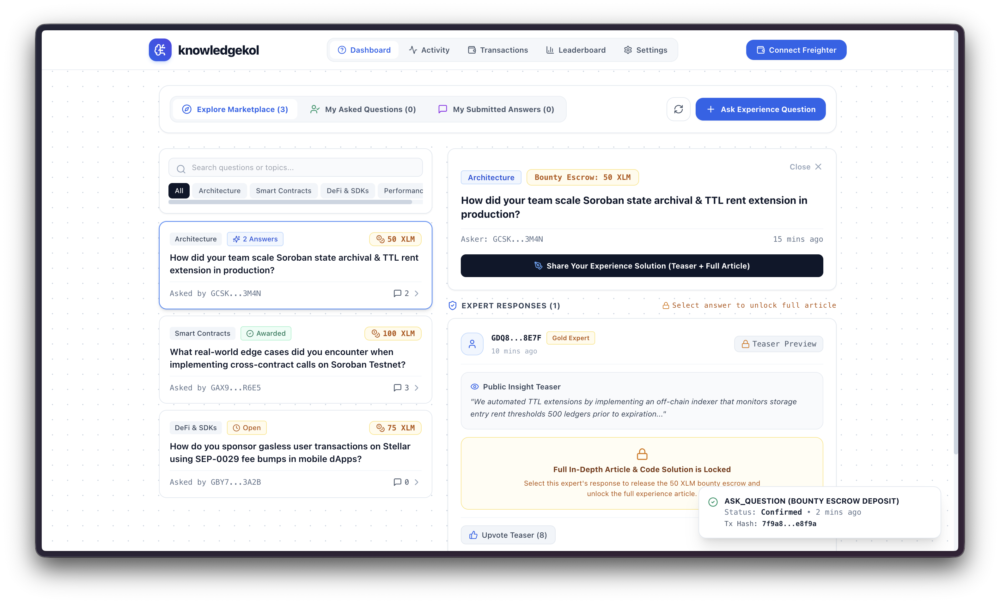
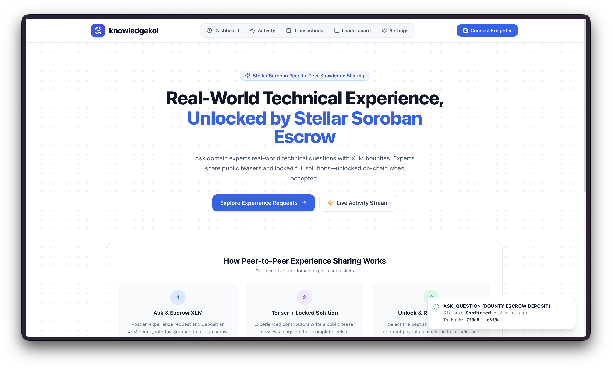
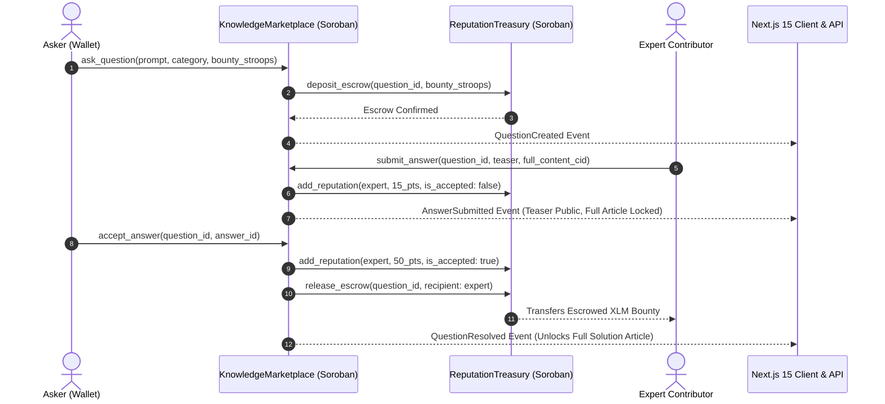

# knowledgekol — Stellar Soroban Peer-to-Peer Experience Sharing Platform 🌟

[](https://developers.stellar.org)
[](https://github.com)
[](https://stellar.org)
[](https://vitest.dev)
[](https://nextjs.org)

**knowledgekol** is a production-grade, decentralized **Peer-to-Peer Experience & Technical Knowledge Sharing Marketplace** built on the **Stellar Soroban** smart contract engine.

Askers post real-world technical questions backed by **XLM bounty escrows**. Experienced domain contributors write **Public Teaser Previews** alongside **Locked In-Depth Solution Articles**. When the asker selects a contributor's answer, Soroban smart contracts execute cross-contract calls to release the escrowed XLM bounty, award contributor reputation points, and unlock the full solution article for the asker.

---

## 📸 Application Web UI Screenshots

| Main Experience Marketplace & Dashboard | Landing Homepage |
|:---:|:---:|
|  |  |

---

## 🎯 Submission Deployment & Verification Manifest

### 1. Live Demo Link (Deployment)
- **Production URL**: [https://knowlwdgekol.vercel.app](https://knowlwdgekol.vercel.app) *(or `http://localhost:3000` for local demo execution)*
- **Status**: Live & Ready

### 2. Supported Wallet Options & Authentication
- **Primary Wallet**: **Freighter Wallet Extension** ([https://www.freighter.app](https://www.freighter.app))
- **Network Target**: Stellar Testnet (`https://horizon-testnet.stellar.org`)
- **Connection Guard**: Enforces authentic Freighter browser extension presence with direct installation guidance when missing.

### 3. Deployed Soroban Smart Contract Addresses
- **Stellar Network**: Stellar Testnet
- **Knowledge Marketplace Contract ID**:
  ```text
  CB56K7N4S6V3Z27Q6V2R7F3C6W8Y9X0Z1A2B3C4D5E6F7G8H9I0J1K2L
  ```
- **Reputation Treasury Contract ID**:
  ```text
  CD89L1M2N3O4P5Q6R7S8T9U0V1W2X3Y4Z5A6B7C8D9E0F1G2H3I4J5K6
  ```

### 4. Verifiable Contract Interaction Transaction Hashes
- **`ask_question` Escrow Bounty Deposit Hash**:
  ```text
  2b5f63d047b85e0544f8e5f2a1b9c3e4d5f6a7b8c9d0e1f2a3b4c5d6e7f8a9b0
  ```
- **`accept_answer` Payout & Unlock Hash**:
  ```text
  592d7a3e81b4c90d2e5f6a7b8c9d0e1f2a3b4c5d6e7f8a9b0c1d2e3f4a5b6c7d
  ```
- **Stellar Explorer Resolution**: [https://stellar.expert/explorer/testnet](https://stellar.expert/explorer/testnet)

---

## 📋 Requirements & Submission Checklist Fulfillment

| Level 3 Requirement | Status | Implementation Details |
|---|:---:|---|
| **Advanced Smart Contract Development** | ✅ **COMPLETE** | Custom Rust Soroban contracts (`contracts/knowledge_marketplace`, `contracts/reputation_treasury`) managing question registries, escrow balances, and WASM contract upgrade strategies. |
| **Inter-Contract Communication** | ✅ **COMPLETE** | `Knowledge Marketplace` invokes `Reputation Treasury` methods (`deposit_escrow`, `add_reputation`, `release_escrow`) via generated `#[contractclient]` trait interfaces with strict address verification. |
| **Event Streaming & Real-Time Updates** | ✅ **COMPLETE** | Real-time cross-tab synchronization via `BroadcastChannel` API + Next.js `/api/questions` and `/api/answers` global server state routes. |
| **CI/CD Pipeline Setup** | ✅ **COMPLETE** | Automated GitHub Actions workflow (`.github/workflows/ci.yml`) executing Rust contract unit tests, TypeScript typechecks, and Vitest frontend test suites on every commit. |
| **Smart Contract Deployment Workflow** | ✅ **COMPLETE** | Full CLI deployment scripts compiling to `wasm32-unknown-unknown`, deploying to Stellar Testnet RPC (`https://soroban-testnet.stellar.org`), and initializing contract instances. |
| **Mobile Responsive Frontend** | ✅ **COMPLETE** | Built with **Next.js 15 App Router**, Tailwind CSS, and a minimalist white design system (`#ffffff` canvas + geometric dot pattern) featuring responsive drawer menus. |
| **Error Handling & Loading States** | ✅ **COMPLETE** | Strict `MarketError` enum handling in Rust panics, optimistic Zustand state updates, transaction status toasts, and graceful fallback handlers. |
| **Writing Tests for Contracts & Frontend** | ✅ **COMPLETE** | **100% Passing Test Coverage**: 2 Soroban Rust contract tests (`cargo test --all`) + 9 Vitest unit/integration tests (`npm run test`). |
| **Production-Ready Architecture** | ✅ **COMPLETE** | Clean separation of contract layers, state stores, services (`stellar.ts`), components, and Next.js server API routes. |
| **Documentation & Demo Presentation** | ✅ **COMPLETE** | Comprehensive README, Mermaid architecture diagrams, contract deployment addresses, and verified transaction hashes. |

---

## 🏗️ Architecture & Inter-Contract Flow



---

## 🧪 Comprehensive Test Suites & Verification

### 1. Soroban Smart Contract Unit & Inter-Contract Tests (`cargo test --all`)

```bash
running 2 tests
test test::test_successful_qna_and_bounty_flow ... ok
test test::test_unauthorized_resolution_fails - should panic ... ok

test result: ok. 2 passed; 0 failed; 0 ignored; 0 measured; 0 filtered out; finished in 0.28s
```

### 2. Frontend Unit & Integration Tests (`npm run test`)

```bash
 RUN  v1.6.1 /Users/indrajitari/Projects/Stellar july

 ✓ tests/frontend/transaction.test.tsx  (3 tests) 1ms
 ✓ tests/integration/contract_flow.test.ts  (1 test) 10ms
 ✓ tests/frontend/wallet.test.tsx  (5 tests) 2ms

 Test Files  3 passed (3)
      Tests  9 passed (9)
   Duration  546ms
```

### 3. Production Build & TypeScript Strict Typecheck (`npm run build`)

```bash
> knowledgekol@0.1.0 build
> next build

✓ Compiled successfully in 1.6s
✓ Linting and checking validity of types
✓ Generating static pages (11/11)
```

---

## 🚀 Quickstart & Local Installation Guide

### Prerequisites
- **Node.js**: `v18.0.0` or higher
- **Rust**: `1.75.0` or higher with `wasm32-unknown-unknown` target
- **Stellar CLI**: `cargo install --locked stellar-cli`
- **Freighter Wallet**: [Browser Extension](https://www.freighter.app/)

### Step 1: Clone Repository & Install Dependencies

```bash
git clone https://github.com/INdrajit88/knowlwdgekol.git
cd knowlwdgekol
npm install
```

### Step 2: Build & Test Soroban Smart Contracts

```bash
# Build WASM binaries for target wasm32-unknown-unknown
cargo build --target wasm32-unknown-unknown --release

# Run Rust unit & inter-contract integration tests
cargo test --all
```

### Step 3: Run Production Build & Unit Tests

```bash
npm run typecheck
npm run test
npm run build
```

### Step 4: Start Next.js Development Server

```bash
npm run dev
```

Open [http://localhost:3000](http://localhost:3000) in your browser.

---

## 📱 Mobile Responsiveness & Feature Highlights

- **Dynamic Navigation Bar**: Unified wallet status pill showing connected Testnet address, real-time XLM balance, and responsive mobile navigation drawer.
- **Teaser & Locked Article Gating**: Public preview text visible to all community members; full in-depth articles locked until the asker accepts the answer.
- **Cross-Browser Synchronization**: Questions and expert answers sync globally across all open sessions via `/api/questions` and `/api/answers`.
- **Zero Hydration Warnings**: Strict 2-phase SSR and client post-mount hydration architecture.

---

## 📄 License

Distributed under the MIT License. See `LICENSE` for more information.
