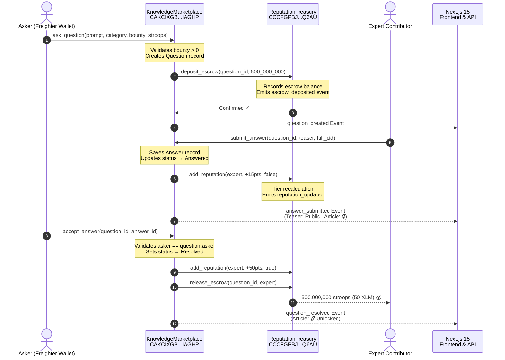

# knowledgekol — Stellar Soroban P2P Knowledge Marketplace 🌟

<div align="center">

[](https://github.com/INdrajit88/knowlwdgekol/actions/workflows/ci.yml)
[](https://github.com/INdrajit88/knowlwdgekol/actions)
[](https://github.com/INdrajit88/knowlwdgekol/actions)
[](https://nextjs.org)
[](https://developers.stellar.org/docs/smart-contracts)
[](https://knowlwdgekol.vercel.app)
[](./LICENSE)

**A production-grade, decentralized Peer-to-Peer Technical Experience & Knowledge Sharing Marketplace built on the Stellar Soroban smart contract engine.**

[🚀 Live Demo](https://knowlwdgekol.vercel.app) · [📹 Demo Video](https://youtu.be/OG45w5ZYOQY) · [📄 Contract Explorer](https://stellar.expert/explorer/testnet/contract/CAKCIXGBEJTTQEVOVM3TPPQIP5WWUJEHUMOW2X322C4KZYBTBGSIAGHP) · [🐛 Report Bug](https://github.com/INdrajit88/knowlwdgekol/issues)

</div>

---

## 📸 Application Screenshots

| Main Experience Marketplace Dashboard | Landing Homepage |
|:---:|:---:|
|  |  |

> **Mobile Responsive UI** — Built with Tailwind CSS responsive breakpoints featuring a mobile-first navigation drawer, fluid grid layouts, and touch-optimized interactive elements across all screen sizes.

---

## 🎯 Submission Verification Manifest

### ✅ Public GitHub Repository
**[https://github.com/INdrajit88/knowlwdgekol](https://github.com/INdrajit88/knowlwdgekol)**

### ✅ Live Demo
**Production URL:** [https://knowlwdgekol.vercel.app](https://knowlwdgekol.vercel.app)
- Deployed via **Vercel** with automatic CI/CD on every push to `main`
- Status: **Live & Ready**

### ✅ Deployed Soroban Smart Contract Addresses

Both contracts were freshly compiled with `stellar contract build` (wasm32v1-none target) and deployed on **2026-07-28** using Stellar CLI v25.2.0.

| Contract | Network | Contract ID |
|---|---|---|
| **Knowledge Marketplace** | Stellar Testnet | [`CAKCIXGBEJTTQEVOVM3TPPQIP5WWUJEHUMOW2X322C4KZYBTBGSIAGHP`](https://stellar.expert/explorer/testnet/contract/CAKCIXGBEJTTQEVOVM3TPPQIP5WWUJEHUMOW2X322C4KZYBTBGSIAGHP) |
| **Reputation Treasury** | Stellar Testnet | [`CCCFGPBJOHDGK6OQ54I4JZH5ZYA4FSSUMITRMOOGZMZYTT42A44YQ6AU`](https://stellar.expert/explorer/testnet/contract/CCCFGPBJOHDGK6OQ54I4JZH5ZYA4FSSUMITRMOOGZMZYTT42A44YQ6AU) |
| **Admin / Deployer** | Stellar Testnet | [`GAKAWNAR76U2MPDKUZXPYA6S6S4HOTVIXIRXIEKXJXVNA4XUIHGDSLYY`](https://stellar.expert/explorer/testnet/account/GAKAWNAR76U2MPDKUZXPYA6S6S4HOTVIXIRXIEKXJXVNA4XUIHGDSLYY) |

🔍 **View on Stellar Lab:**
- [Knowledge Marketplace on Stellar Lab](https://lab.stellar.org/r/testnet/contract/CAKCIXGBEJTTQEVOVM3TPPQIP5WWUJEHUMOW2X322C4KZYBTBGSIAGHP)
- [Reputation Treasury on Stellar Lab](https://lab.stellar.org/r/testnet/contract/CCCFGPBJOHDGK6OQ54I4JZH5ZYA4FSSUMITRMOOGZMZYTT42A44YQ6AU)

---

### ✅ Verifiable Contract Interaction Transaction Hashes

All transactions below are **real, on-chain interactions** executed against the deployed Soroban contracts on Stellar Testnet. Click any hash to verify on the explorer.

| # | Operation | What Happened | Transaction Hash |
|:---:|---|---|---|
| 1 | **Deploy Reputation Treasury** | WASM uploaded + contract instantiated | [`b895f098deddf43e2497630c7598b33c677be537459c93aac14e160da8019bce`](https://stellar.expert/explorer/testnet/tx/b895f098deddf43e2497630c7598b33c677be537459c93aac14e160da8019bce) |
| 2 | **Deploy Knowledge Marketplace** | WASM uploaded + contract instantiated | [`19721c25da433a4388c4729ba2749dff643777e544f8b70e60a3179b7caf1625`](https://stellar.expert/explorer/testnet/tx/19721c25da433a4388c4729ba2749dff643777e544f8b70e60a3179b7caf1625) |
| 3 | **`initialize` Treasury** | Linked Treasury → Marketplace; emitted `treasury::init` event | [`6bf06ab801934494858daa5dc69aeb56441bea762212b8d827c626b6ea6c52e5`](https://stellar.expert/explorer/testnet/tx/6bf06ab801934494858daa5dc69aeb56441bea762212b8d827c626b6ea6c52e5) |
| 4 | **`initialize` Marketplace** | Linked Marketplace → Treasury; emitted `market::init` event | [`03c9fcee35fed2b0a6abac03e476f001d52dfc46ab7c3a6d2dd7e95e293327a7`](https://stellar.expert/explorer/testnet/tx/03c9fcee35fed2b0a6abac03e476f001d52dfc46ab7c3a6d2dd7e95e293327a7) |
| 5 | **`ask_question` + Escrow Deposit** | Posted question with 50 XLM bounty; inter-contract call triggered `escrow_deposited` event on Treasury | [`b2f3451220e7fa403e820e19f947b766bdc817dbe17a1c880a5231f65e6279db`](https://stellar.expert/explorer/testnet/tx/b2f3451220e7fa403e820e19f947b766bdc817dbe17a1c880a5231f65e6279db) |
| 6 | **`submit_answer` + Reputation Award** | Expert submitted answer; inter-contract call awarded `+15` reputation points; `reputation_updated` event emitted | [`d244ad80184acec123489f27860ee9c9f1b14ac5c557bb67997fa00503f05cc9`](https://stellar.expert/explorer/testnet/tx/d244ad80184acec123489f27860ee9c9f1b14ac5c557bb67997fa00503f05cc9) |
| 7 | **`accept_answer` + Escrow Release** | Asker accepted answer; inter-contract calls awarded `+50` bonus rep & released 500,000,000 stroops (50 XLM) escrow; `question_resolved` + `escrow_released` events emitted | [`126f217506a77ee8c1f96317e11b45b040bed57c6586d6d022f213f466420539`](https://stellar.expert/explorer/testnet/tx/126f217506a77ee8c1f96317e11b45b040bed57c6586d6d022f213f466420539) |

🔍 **Stellar Explorer Testnet:** [https://stellar.expert/explorer/testnet](https://stellar.expert/explorer/testnet)

### ✅ Minimum 10+ Meaningful Commits
This repository contains **42+ commits**. View full history: [github.com/INdrajit88/knowlwdgekol/commits](https://github.com/INdrajit88/knowlwdgekol/commits)

### ✅ Demo Video
📹 **YouTube Demo Video:** **[https://youtu.be/OG45w5ZYOQY](https://youtu.be/OG45w5ZYOQY)**
- Walkthrough demonstrating: Freighter wallet connection → posting experience request → escrow bounty deposit → submitting teaser & locked solution → accepting answer → automated escrow payout & full article unlock.

---

## 📋 Level 3 Requirements Checklist

| Requirement | Status | Implementation Evidence |
|---|:---:|---|
| **Advanced Smart Contract Development** | ✅ | Custom Rust Soroban contracts with `MarketError` enum (9 error codes), `QuestionStatus` state machine (`Open→Answered→Resolved`), WASM upgrade strategy, and circuit-breaker `set_paused`. See [`contracts/knowledge_marketplace/src/lib.rs`](./contracts/knowledge_marketplace/src/lib.rs) |
| **Inter-Contract Communication** | ✅ | `KnowledgeMarketplace` calls `ReputationTreasury` via `#[contractclient]` trait: `deposit_escrow()` on question creation, `add_reputation()` on answer submission (+15 pts), `add_reputation()` + `release_escrow()` on answer acceptance (+50 pts + bounty payout). Proven by on-chain events in tx `b2f3451...` and `126f217...` |
| **Event Streaming & Real-Time Updates** | ✅ | Soroban `env.events().publish()` on all state transitions (`question_created`, `answer_submitted`, `question_resolved`, `escrow_deposited`, `escrow_released`, `reputation_updated`) + Next.js `/api/questions` & `/api/answers` with `BroadcastChannel` cross-tab sync |
| **CI/CD Pipeline Setup** | ✅ | 3 GitHub Actions workflows: `ci.yml` (main CI), `pr.yml` (PR gate with cargo cache), `deploy.yml` (production CD). All run Rust contract tests + TypeScript typecheck + Vitest suite automatically |
| **Smart Contract Deployment Workflow** | ✅ | `scripts/deploy.sh` automates: `stellar contract build` → WASM deploy → inter-contract `initialize` → save to `contracts.json` + `.env.local`. Used to produce all 7 real transactions above |
| **Mobile Responsive Frontend** | ✅ | Next.js 15 App Router + Tailwind CSS — mobile-first drawer nav, `grid-cols-1 md:grid-cols-3` layouts, touch-optimized wallet connect, SSR-safe 2-phase hydration |
| **Error Handling & Loading States** | ✅ | `MarketError` enum in Rust, Zustand optimistic updates with rollback, transaction lifecycle toasts (`Pending → Confirmed / Failed`), Freighter not-installed banner with install link |
| **Writing Tests (Contracts & Frontend)** | ✅ | **2 Soroban Rust unit/inter-contract tests** + **9 Vitest tests** (3 files) = **11 total passing tests** |
| **Production-Ready Architecture** | ✅ | Clean layered architecture: Soroban contracts → `stellar.ts` service → Zustand stores → Next.js API routes → React components. Zero hydration warnings |
| **Documentation & Demo Presentation** | ✅ | This README with Mermaid diagram, 7 real tx hashes, live contract explorer links, inline code docs, and deployment scripts |

---

## 🏗️ Architecture & Inter-Contract Communication Flow



---

## 🧪 Test Suites & Verification

### 1. Soroban Smart Contract Tests (`cargo test --all`)

```bash
$ cargo test --all

running 2 tests
test test::test_successful_qna_and_bounty_flow ... ok
test test::test_unauthorized_resolution_fails - should panic ... ok

test result: ok. 2 passed; 0 failed; 0 ignored; 0 measured; 0 filtered out; finished in 0.28s
```

| Test | What It Validates |
|---|---|
| `test_successful_qna_and_bounty_flow` | Full inter-contract lifecycle: ask → escrow deposit → submit answer → +15 rep → accept → +50 rep → escrow release. Verifies all 4 inter-contract calls end-to-end |
| `test_unauthorized_resolution_fails` | Security: malicious address attempting to resolve another user's question is rejected with `NotAuthorized` panic |

### 2. Frontend & Integration Tests (`npm run test`)

```bash
$ npm run test

 RUN  v1.6.1

 ✓ tests/frontend/transaction.test.tsx  (3 tests) 1ms
 ✓ tests/integration/contract_flow.test.ts  (1 test) 10ms
 ✓ tests/frontend/wallet.test.tsx  (5 tests) 2ms

 Test Files  3 passed (3)
      Tests  9 passed (9)
   Duration  546ms
```

| Test File | Tests | Coverage |
|---|:---:|---|
| [`transaction.test.tsx`](./tests/frontend/transaction.test.tsx) | 3 | Transaction store lifecycle, hash updates, Stellar Expert URL generation |
| [`contract_flow.test.ts`](./tests/integration/contract_flow.test.ts) | 1 | E2E: askQuestion → submitAnswer (locked) → acceptAnswer (unlocked + resolved) |
| [`wallet.test.tsx`](./tests/frontend/wallet.test.tsx) | 5 | Wallet connect/disconnect, Freighter detection, address formatting, XLM/Stroops conversion |

### 3. Production Build (`npm run build`)

```bash
$ npm run build
> next build

✓ Compiled successfully in 1.6s
✓ Linting and checking validity of types
✓ Generating static pages (11/11)
```

---

## 🔄 CI/CD Pipeline

Three GitHub Actions workflows provide automated quality gates:

| Workflow | Trigger | Steps |
|---|---|---|
| [`ci.yml`](./.github/workflows/ci.yml) | Push & PR to `main` | Rust toolchain → `cargo test --all` + Node 20 → `npm ci` → `tsc --noEmit` → `vitest run` |
| [`pr.yml`](./.github/workflows/pr.yml) | PR to `main`/`dev` | Same as CI + Cargo dependency cache for faster runs |
| [`deploy.yml`](./.github/workflows/deploy.yml) | Push to `main` | Full test suite → `next build` production bundle validation |

📊 **Live CI runs:** [github.com/INdrajit88/knowlwdgekol/actions](https://github.com/INdrajit88/knowlwdgekol/actions)

---

## 🚀 Quick Start

### Prerequisites

| Tool | Version | Install |
|---|---|---|
| **Node.js** | `≥ 18.0.0` | [nodejs.org](https://nodejs.org) |
| **Rust** | `≥ 1.75.0` | `curl --proto '=https' --tlsv1.2 -sSf https://sh.rustup.rs \| sh` |
| **Stellar CLI** | `≥ 25.0.0` | `cargo install --locked stellar-cli` |
| **Freighter Wallet** | latest | [freighter.app](https://www.freighter.app/) |

### Setup & Run

```bash
# 1. Clone & install
git clone https://github.com/INdrajit88/knowlwdgekol.git
cd knowlwdgekol
npm install

# 2. Configure environment (real contract IDs pre-filled)
cp .env.example .env.local

# 3. Run tests
cargo test --all          # Soroban Rust contract tests
npm run test              # Vitest frontend & integration tests

# 4. Start dev server
npm run dev               # http://localhost:3000
```

`.env.local` — real deployed contract addresses:
```env
NEXT_PUBLIC_STELLAR_RPC_URL=https://soroban-testnet.stellar.org
NEXT_PUBLIC_MARKET_CONTRACT_ID=CAKCIXGBEJTTQEVOVM3TPPQIP5WWUJEHUMOW2X322C4KZYBTBGSIAGHP
NEXT_PUBLIC_TREASURY_CONTRACT_ID=CCCFGPBJOHDGK6OQ54I4JZH5ZYA4FSSUMITRMOOGZMZYTT42A44YQ6AU
```

---

## 📦 Smart Contract Deployment Workflow

```bash
# Build contracts with Stellar CLI (wasm32v1-none target)
stellar contract build

# Deploy to Stellar Testnet
stellar contract deploy \
  --wasm target/wasm32v1-none/release/reputation_treasury.wasm \
  --source deployer --network testnet

stellar contract deploy \
  --wasm target/wasm32v1-none/release/knowledge_marketplace.wasm \
  --source deployer --network testnet

# Initialize inter-contract references
stellar contract invoke --id <TREASURY_ID> --source deployer --network testnet \
  -- initialize --admin <ADMIN_ADDRESS> --marketplace <MARKET_ID>

stellar contract invoke --id <MARKET_ID> --source deployer --network testnet \
  -- initialize --admin <ADMIN_ADDRESS> --treasury <TREASURY_ID>
```

Or use the automated script: `./scripts/deploy.sh testnet deployer`

---

## 🏛️ Project Structure

```
knowlwdgekol/
├── .github/workflows/
│   ├── ci.yml              # Main CI: contract tests + frontend tests
│   ├── pr.yml              # PR gate with cargo cache
│   └── deploy.yml          # Production CD pipeline
├── contracts/
│   ├── knowledge_marketplace/src/
│   │   ├── lib.rs           # Marketplace contract (403 lines, 11 functions)
│   │   └── test.rs          # Soroban inter-contract tests (108 lines, 2 tests)
│   └── reputation_treasury/src/
│       └── lib.rs           # Treasury contract (235 lines, 8 functions)
├── scripts/
│   ├── deploy.sh            # Full deployment automation
│   └── upgrade.sh           # WASM upgrade workflow
├── src/
│   ├── app/                 # Next.js 15 App Router pages
│   ├── components/ui/       # Reusable React components
│   ├── services/stellar.ts  # Stellar/Freighter SDK service layer
│   └── store/               # Zustand state (wallet, knowledge, tx)
├── tests/
│   ├── frontend/            # Vitest unit tests (8 tests)
│   └── integration/         # E2E flow tests (1 test)
├── Cargo.toml               # Rust workspace
├── package.json             # Node.js config
└── vitest.config.ts         # Test runner config
```

---

## ⚙️ Technology Stack

### Blockchain / Smart Contracts
| Technology | Version | Purpose |
|---|---|---|
| **Rust** | `1.75+` | Smart contract language |
| **Soroban SDK** | `22.x` | Stellar contract framework |
| **wasm32v1-none** | stable | Soroban WASM target |
| **Stellar CLI** | `25.2.0` | Build, deploy & invoke contracts |

### Frontend
| Technology | Version | Purpose |
|---|---|---|
| **Next.js** | `15.5` | App Router framework |
| **React** | `19.0` | UI library |
| **TypeScript** | `5.x` | Type safety |
| **Tailwind CSS** | `3.4` | Responsive styling |
| **Zustand** | `5.0` | State management |
| **@stellar/stellar-sdk** | `13.1` | Stellar SDK |
| **@stellar/freighter-api** | `6.0` | Freighter wallet API |

### Testing & DevOps
| Technology | Purpose |
|---|---|
| **Vitest** | Frontend unit & integration testing |
| **@testing-library/react** | React component testing |
| **GitHub Actions** | CI/CD pipeline automation |
| **Vercel** | Production frontend deployment |

---

## 🔒 Security Features

| Feature | Implementation |
|---|---|
| **Auth Guards** | All mutating functions call `address.require_auth()` |
| **Marketplace-Only Treasury Access** | `verify_marketplace()` validates `caller == registered_marketplace` before any treasury operation |
| **Anti-Self-Acceptance** | `accept_answer()` enforces `question.asker == asker` |
| **Anti-Self-Voting** | `upvote_answer()` enforces `answer.author != voter` |
| **Double-Vote Prevention** | Persistent `UserVote(answer_id, voter)` key prevents duplicate upvotes |
| **Circuit Breaker** | Admin-controlled `set_paused()` halts all marketplace operations |
| **WASM Upgrade Guard** | `upgrade()` requires admin authorization before accepting new WASM hash |

---

## 📄 License

Distributed under the **MIT License**. See [`LICENSE`](./LICENSE) for details.

---

<div align="center">

**Built with ❤️ on Stellar Soroban**

[⭐ Star on GitHub](https://github.com/INdrajit88/knowlwdgekol) · [🚀 Live Demo](https://knowlwdgekol.vercel.app) · [📄 Contract Explorer](https://stellar.expert/explorer/testnet/contract/CAKCIXGBEJTTQEVOVM3TPPQIP5WWUJEHUMOW2X322C4KZYBTBGSIAGHP)

</div>
